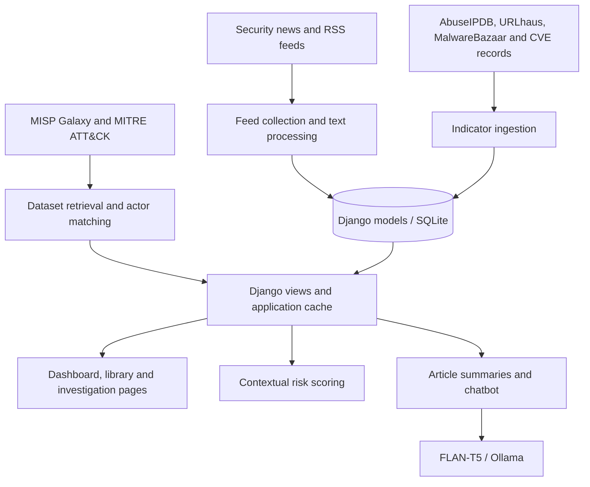

# Threat Intelligence Aggregation and Reporting Framework (TIARF)

### Cyber Threat Intelligence & Analysis Platform

TIARF brings security news, indicators of compromise, vulnerability records, and threat actor intelligence into one Django-based workspace. It helps users explore emerging threats, understand adversary techniques, and prioritize intelligence through contextual risk scores and AI-assisted summaries.

Built as a **final year project**, the platform connects information from multiple sources so users can move from a broad threat overview to the actors, techniques, tools, and indicators behind it.

**[Features](#features) - [Architecture](#architecture) - [Screenshots](#screenshots) - [Getting started](#getting-started) - [Project structure](#project-structure)**

---

## Overview

Threat intelligence is often scattered across research blogs, reputation services, vulnerability repositories, and adversary knowledge bases. TIARF brings these sources together in an interface designed for investigation and exploration.

A typical workflow starts with reviewing recent intelligence on the dashboard, filtering it by topic or time period, and opening an article or entity for more context. Users can then explore related threat actors, browse MITRE ATT&CK techniques, inspect indicator records, or use the chatbot to query supported intelligence topics.

The project is a research and development application. Its scores support prioritization; they are not independently validated predictions of an attack.

## Features

| Capability | What it provides |
| --- | --- |
| **Intelligence dashboard** | An overview of collected feeds, trending entities, and topic/time filters. |
| **News collection and article analysis** | Feed ingestion, article reading, entity extraction, and AI-assisted summaries. |
| **Indicator library** | A searchable collection of IP addresses, malicious URLs, malware records, and CVEs, with source and reputation context. |
| **Contextual risk scoring** | Weighted scores based on threat keywords, recency, entity density, source reputation, and actor context in actor-oriented scoring. |
| **Threat actor exploration** | Profiles based on MISP Galaxy data, with actor details and associated intelligence. |
| **MITRE ATT&CK browser** | Exploration of tactics, techniques, groups, and software across Enterprise, Mobile, and ICS datasets. |
| **Actor matching** | Name and alias matching between MISP actors and MITRE groups, with combined detail views for investigation. |
| **IP reputation checks** | On-demand IP lookups through the AbuseIPDB integration. |
| **Intelligence chatbot** | Topic-specific responses backed by application logic, with an Ollama-based response path. |

### How risk scoring works

The scoring engine calculates individual factors, applies their weights, and normalizes the result to a **0-100** score. It also returns each factor's contribution so the result can be inspected.

The standard article configuration uses keyword threat content (45%), recency (35%), entity density (10%), and source reputation (10%). Actor-oriented scoring uses a separate weighting configuration. Results are categorized as **Low**, **Medium**, **High**, or **Critical**.

These are application-defined heuristics. Entity extraction and actor matching also use rules and text similarity, so results should be reviewed alongside the original sources.

## Architecture



| Component | Implementation | Responsibility |
| --- | --- | --- |
| Web application | [App/views.py](App/views.py), [App/urls.py](App/urls.py) | Dashboard, filtering, investigation pages, chatbot, and HTTP endpoints. |
| Persistence | [App/models.py](App/models.py), [migrations](App/migrations/) | Store feeds, indicators, profiles, trending data, and ATT&CK entities. |
| Indicator ingestion | [App/ingest_feed.py](App/ingest_feed.py) | Retrieve URL, malware, IP, and CVE records. |
| News ingestion | [ingest_news.py](App/management/commands/ingest_news.py) | Collect and update intelligence feeds. |
| Scoring | [App/scoring_engine.py](App/scoring_engine.py) | Calculate weighted scores and factor contributions. |
| Integration utilities | [App/integrator.py](App/integrator.py) | MISP/MITRE integration and OTX enrichment logic. |
| Interface | [templates](App/templates/), [static assets](App/static/) | Server-rendered pages, styles, scripts, and visual assets. |
| Configuration | [settings.py](threatintel/settings.py), [env.py](threatintel/env.py) | Django settings and local environment-variable loading. |

Some external datasets are fetched and cached by views; not every source follows the same database ingestion path.

## Intelligence sources

The code includes integrations for the following sources. Access depends on provider availability, credentials, and request limits.

| Source | Use in the project |
| --- | --- |
| Security publisher feeds | News, research articles, and threat reporting. |
| AbuseIPDB | IP reputation lookups and blacklist records. |
| URLhaus | Malicious URL records. |
| MalwareBazaar | Malware metadata and hashes. |
| CVEProject / cvelistV5 | Vulnerability records retrieved through a local Git checkout. |
| MISP Galaxy | Threat actor names, aliases, and descriptive context. |
| MITRE ATT&CK | Tactics, techniques, groups, software, and relationships. |
| AlienVault OTX | Indicator enrichment logic in the integration module. |

## Screenshots

Expand a section to view its screenshot area. Screenshots will be added as the project documentation is completed.

<details>
<summary><strong>Dashboard - intelligence overview</strong></summary>

Overview of collected intelligence, trends, and filtering controls.


</details>

<details>
<summary><strong>AI-Summery and entities extraction</strong></summary>

Read a collected article and inspect its analysis or generated summary.


</details>

<details>
<summary><strong>Threat actors - profiles and attribution context</strong></summary>

Browse actor profiles and review the information associated with an actor.


</details>

<details>
<summary><strong>MITRE ATT&CK - tactics and techniques</strong></summary>

Explore ATT&CK data and open technique details for further investigation.


</details>

<details>
<summary><strong>Groups and tools - adversary capabilities</strong></summary>

Review adversary groups and the software or tools represented in ATT&CK data.


</details>

<details>
<summary><strong>Threat library - indicators and vulnerabilities</strong></summary>

Explore IP addresses, URLs, malware records, and CVEs with supporting context.


</details>

<details>
<summary><strong>Chatbot - conversational intelligence exploration</strong></summary>

Ask supported threat intelligence questions through the chat interface.

</details>

See [the screenshot guide](docs/screenshots/README.md) for filenames and instructions on adding images to these dropdowns.

## Tech stack

| Layer | Technologies |
| --- | --- |
| Backend | Python, Django |
| Storage | SQLite through the Django ORM |
| Interface | Django templates, HTML, CSS, JavaScript, Bootstrap assets |
| Collection and parsing | Requests, Feedparser, Beautiful Soup, python-dateutil |
| Analysis | pandas, scikit-learn, application-defined scoring rules |
| Article summaries | Hugging Face Transformers, PyTorch, Google FLAN-T5 Base |
| Chatbot model integration | Ollama with `llama3.2:1b` |
| Local configuration | python-dotenv |

## Getting started

### 1. Clone the repository

```powershell
git clone https://github.com/beep1st/threatintel.git
cd threatintel
python -m venv .venv
```

The commands below use the virtual environment's Python executable directly, so PowerShell activation is not required. On macOS/Linux, use `.venv/bin/python` instead of `.venv\Scripts\python.exe`.

### 2. Install dependencies

```powershell
.venv\Scripts\python.exe -m pip install -r requirements.txt
.venv\Scripts\python.exe -m pip install psutil ollama torch transformers sentencepiece pandas scikit-learn schedule
```

The second command supplies packages imported by the current source but not yet included in [requirements.txt](requirements.txt). This is a setup workaround, not a tested dependency lockfile. Model downloads require additional disk space and an internet connection; dependency compatibility still needs validation in a fresh environment.

### 3. Configure local credentials

For a fresh checkout, copy the example configuration:

```powershell
Copy-Item .env.example .env
.venv\Scripts\python.exe -c "import secrets; print(secrets.token_urlsafe(50))"
```

Paste the generated value into `DJANGO_SECRET_KEY` in `.env`. If you already have a local `.env`, preserve it instead of overwriting it.

| Variable | Purpose |
| --- | --- |
| `DJANGO_SECRET_KEY` | A unique secret for Django signing. Replace the example value. |
| `ABUSEIPDB_API_KEY` | AbuseIPDB reputation and blacklist requests. |
| `MALWAREBAZAAR_AUTH_KEY` | Authentication for the abuse.ch integration paths that use it. |
| `OTX_API_KEY` | OTX enrichment in the integration module. |

The application loads `.env` from the project root. Existing process environment variables take precedence. Credentials, the SQLite database, uploaded media, and downloaded caches are excluded by [.gitignore](.gitignore).

### 4. Initialize and start the application

```powershell
.venv\Scripts\python.exe manage.py migrate
.venv\Scripts\python.exe manage.py runserver
```

Open **http://127.0.0.1:8000/**. A fresh checkout does not include the original local database, so feed-backed pages need data ingestion before they show collected records.

### 5. Populate intelligence data

Run the relevant commands in another terminal from the project root:

```powershell
# Collect a batch of news feeds
.venv\Scripts\python.exe manage.py ingest_news --limit 20

# Collect URL, malware, IP, and CVE records
.venv\Scripts\python.exe manage.py ingest_threats

# Continue collecting news at five-minute intervals
.venv\Scripts\python.exe manage.py ingest_news --continuous --interval 5 --limit 20
```

These commands contact external services. Git must be available on PATH for the CVE checkout; authenticated providers require their corresponding keys. Keep the continuous ingestion process running while updates are needed.

### 6. Enable local model features

Article summarization loads `google/flan-t5-base` on first use and selects CUDA when available, otherwise CPU. If generation fails, the implementation falls back to an excerpt.

For the Ollama chatbot path, install and run Ollama locally, then download the model named in the source:

```powershell
ollama pull llama3.2:1b
```

Model-generated text should be checked against the underlying intelligence sources.

## Project structure

```text
threatintel/
+-- App/
|   +-- management/commands/   # News and indicator ingestion commands
|   +-- migrations/           # Database schema history
|   +-- static/               # Styles, scripts, and interface assets
|   +-- templates/            # Dashboard and investigation pages
|   +-- ingest_feed.py        # Indicator collection
|   +-- integrator.py         # Cross-source integration utilities
|   +-- models.py             # Data models
|   +-- scoring_engine.py     # Weighted scoring and factor calculators
|   +-- urls.py               # Application routes
|   +-- views.py              # Web application behavior
+-- docs/screenshots/         # Screenshot guide and future images
+-- threatintel/              # Django configuration and entry points
+-- .env.example              # Credential template without live keys
+-- .gitignore
+-- manage.py
+-- requirements.txt
+-- README.md
```

## Validation and current limitations

Once dependencies are installed, Django's standard checks can be run with:

```powershell
.venv\Scripts\python.exe manage.py check
.venv\Scripts\python.exe manage.py test
```

The current [test module](App/tests.py) is a scaffold rather than an implemented automated test suite. The root [test.py](test.py) is a database maintenance script, not a regression test runner.

Current areas for improvement include:

- **Reproducible installation:** consolidate imported packages into a validated dependency specification.
- **Ingestion consistency:** the separate `auto_ingest` command references an unregistered `ingest_feed` command. Use the documented `ingest_news --continuous` path for recurring news collection.
- **Matching quality:** actor name/alias matches require review; similarity does not establish attribution.
- **Operational resilience:** upstream changes, provider limits, and network failures can affect collection and dataset retrieval.
- **Evaluation:** automated regression tests and measured scoring/model evaluation remain future work.

## Deployment considerations

The committed settings enable `DEBUG` and allow all hosts. Some application endpoints are CSRF-exempt, and the dashboard does not implement a comprehensive authenticated access boundary. Run the current application locally; before hosting it, configure production settings, authentication and authorization, endpoint protections, HTTPS, and an appropriate application server.

Keep credentials and collected local data out of commits and screenshots. The repository contains application code and assets, not the original working database or model caches.

## Acknowledgments and licensing

TIARF builds on the work of the Django and Python communities and the intelligence made available through MITRE ATT&CK, MISP Galaxy, CVEProject, abuse.ch, AbuseIPDB, OTX, and security researchers and publishers.

Third-party datasets, models, and bundled interface assets remain subject to their respective terms. This repository currently has no project-level license file; no MIT or other project license is claimed here.
